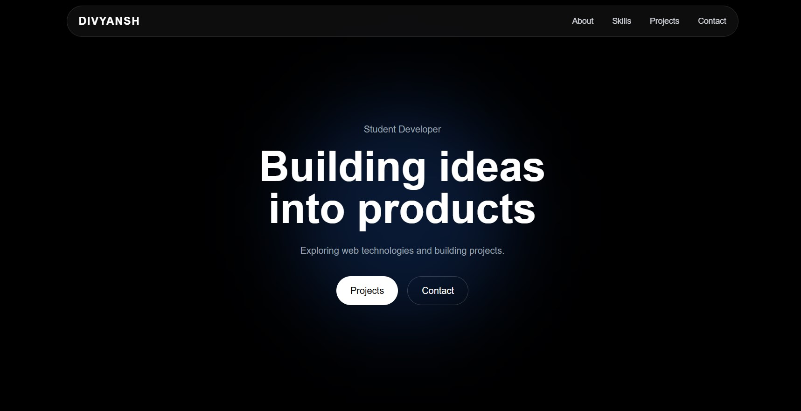
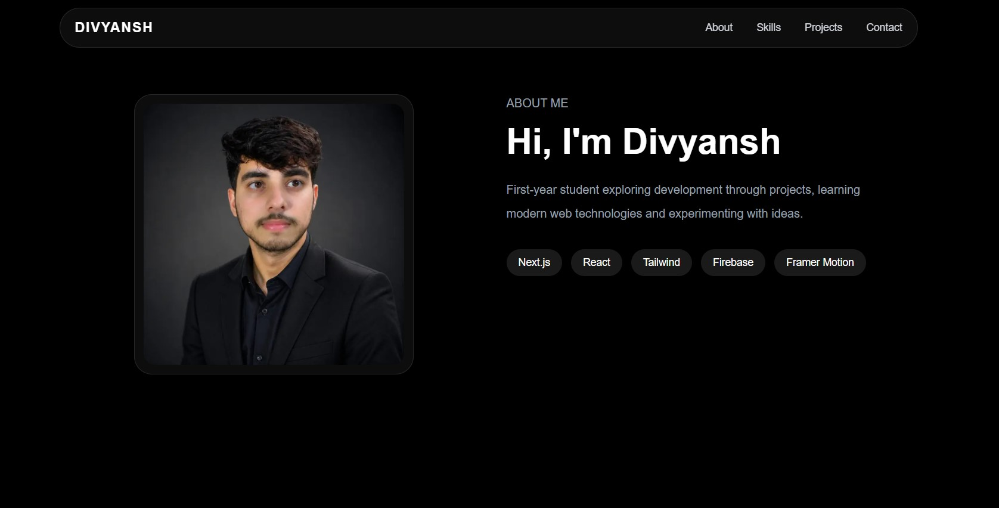
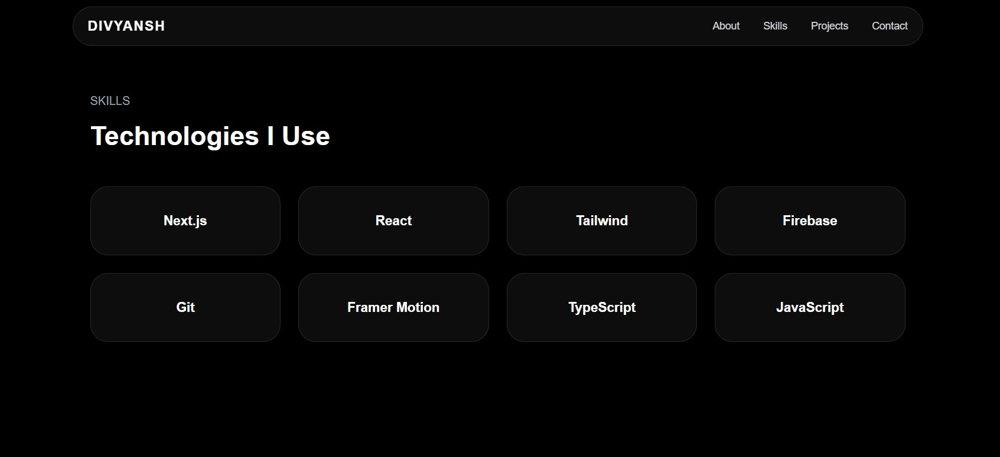

# 🚀 Modern Developer Portfolio

A fully responsive and modern personal portfolio built using **Next.js, Tailwind CSS, and Firebase**, deployed on **Vercel**.

---

## 🌐 Live Demo

👉 https://portfolio-alpha-ochre-48.vercel.app/

---

## 🧑‍💻 About

This is my personal developer portfolio showcasing projects, skills, and contact functionality using Firebase.

---

## 📸 Preview

### 🏠 Hero Section


---

### 👨‍💻 About Section


---

### 🧠 Skills Section


---

### 📁 Projects Section


---

### 📩 Contact Section


---

## ⚙️ Tech Stack

- Next.js (React Framework)
- Tailwind CSS
- Firebase Firestore
- Vercel (Deployment)
- Git & GitHub

---

## ✨ Features

### 🎯 UI / UX
- Fully responsive design (mobile, tablet, desktop)
- Modern glassmorphism navbar
- Smooth scroll navigation
- Clean UI with spacing system
- Hover animations

---

### 🧭 Navigation
- Desktop navbar
- Mobile hamburger menu
- Section-based navigation

---

### 🧑‍💻 Hero Section
- Responsive typography scaling
- CTA buttons
- Clean centered layout

---

### 👨‍💻 About Section
- Profile image support
- Personal introduction
- Responsive layout

---

### 🧠 Skills Section
- Grid-based layout
- Hover effects
- Tech badges

---

### 📁 Projects Section
- Dynamic project rendering
- Image preview support
- GitHub + Live links
- Responsive grid

---

### 📩 Contact Section
- Firebase Firestore integration
- Stores:
  - Name
  - Email
  - Message
  - Timestamp

---

## 🔥 Firebase Setup

Firestore is used for contact form submissions.

rules_version = '2';
service cloud.firestore {
  match /databases/{database}/documents {

    match /messages/{docId} {
      allow create: if true;
      allow read, update, delete: if false;
    }

  }
}

---

## 📁 Clean Project Structure

```
src/
├── app/
│   └── page.tsx
│
├── components/
│   ├── Navbar.tsx
│   ├── Hero.tsx
│   ├── About.tsx
│   ├── Skills.tsx
│   ├── Projects.tsx
│   ├── Contact.tsx
│   └── Footer.tsx
│
├── data/
│   └── projects.ts
│
├── lib/
│   └── firebase.ts
│
public/
├── hero.png
├── about.png
├── skills.png
├── projects.png
├── contact.png
├── profile.jpeg
└── project-images/
```

---

## 🚀 Deployment

Deployed using **Vercel** with GitHub integration.

Every push to main branch auto deploys the project.

---

## 💡 What I Learned

- Next.js component architecture
- Tailwind responsive design
- Firebase Firestore integration
- React form handling
- Git workflow
- Deployment on Vercel

---

## 📬 Contact

GitHub: https://github.com/itsdivyanshuno  
Email: your-email@gmail.com

---

## ⭐ Support

If you like this project:
- ⭐ Star this repo
- 🍴 Fork it
- 🚀 Share it